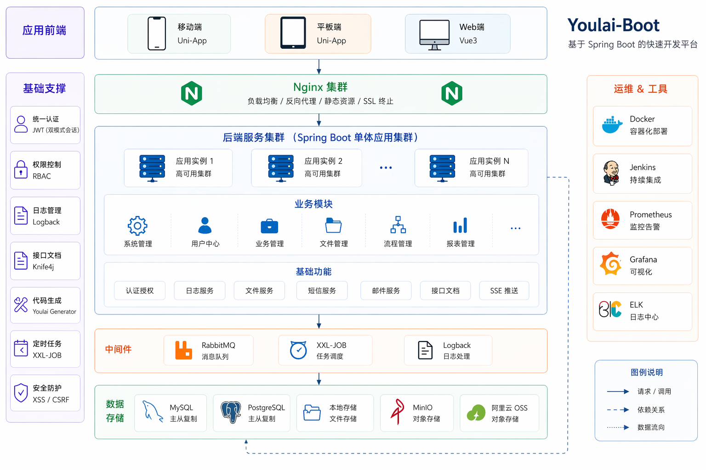

<div align="center">


# youlai-boot-tenant

**Spring Boot 4 多租户企业级权限管理系统后端**

[](https://spring.io/projects/spring-boot)
[](https://openjdk.org/)
[](#)
[](LICENSE)
[](https://gitee.com/youlaiorg/youlai-boot-tenant/stargazers)

</div>


<div align="center">

[🖥️ 在线预览](https://vue.youlai.tech) | [📲 移动端预览](https://app.youlai.tech) | [📖 文档](https://www.youlai.tech/docs/admin/backend/java/)

</div>

## 简介

**youlai-boot-tenant** 是 [youlai-boot](https://gitee.com/youlaiorg/youlai-boot) 的多租户版本，基于 Spring Boot 4，采用 MyBatis-Plus 单库多租户方案，通过租户 ID 实现数据隔离，专为 SaaS 应用提供后端支持。配套前端 [vue3-element-admin](https://gitee.com/youlaiorg/vue3-element-admin)，共享同一套 API 规范。

## 核心特性

- 🏢 **多租户架构** — 基于 MyBatis-Plus 单库多租户，通过租户 ID 实现数据隔离
- � **安全体系** — Spring Security + JWT/Redis Token 双会话模式、令牌续期、多端互斥
- 🛡️ **细粒度权限** — RBAC 五级：数据 → 菜单 → 按钮 → 接口 → 字段
- ⚡ **代码生成器** — 一键生成前后端 CRUD 代码
- 📦 **模块齐全** — 用户、角色、菜单、部门、字典、文件、定时任务、消息中心、操作日志
- 🔌 **实时通信** — SSE 推送：在线用户数、字典同步、通知广播

## 技术架构

<p align="center">
  
</p>

## 系统预览

**PC 端**

<table align="center">
  <tr>
    <td></td>
    <td></td>
  </tr>
  <tr>
    <td></td>
    <td></td>
  </tr>
  <tr>
    <td></td>
    <td></td>
  </tr>
</table>

**移动端**

<table align="center">
  <tr>
    <td></td>
    <td></td>
    <td></td>
    <td></td>
  </tr>
</table>

## 快速开始

**环境要求**：JDK 17+ · MySQL 8.0+ · Redis 6.0+

1. 克隆项目：`git clone https://gitee.com/youlaiorg/youlai-boot-tenant.git`
2. 导入数据库：`sql/youlai_admin_tenant.sql`
3. 修改配置（可选，默认已配置线上只读数据源）：`src/main/resources/application-dev.yml`
4. 启动服务，访问 http://localhost:8000/doc.html

默认账号：`admin` / `123456`

**Docker 部署**：`cd docker && docker-compose up -d`

详细指南：[部署文档](https://www.youlai.tech/docs/admin/backends/java/deploy) · [开发规范](https://www.youlai.tech/docs/admin/backends/java/dev-standards)

## 🧪 多租户测试

- **预置租户**: 平台默认租户 (`tenant_id=0`) 和演示租户 (`tenant_id=1`)。
- **预置账号**: 平台租户 (`root`/`admin`) 和演示租户 (`admin`)，默认密码 `123456`。
- **本地测试**: 修改本地 `hosts` 文件，添加 `127.0.0.1 vue.youlai.tech` 和 `127.0.0.1 demo.youlai.tech`，通过不同域名访问即可自动切换租户。

## 技术栈

| 技术 | 版本 | 说明 |
|:-----|:-----|:-----|
| Spring Boot | 4.0.5 | 核心框架 |
| Spring Security | 6.x | 认证授权 |
| MyBatis-Plus | 3.5.15 | ORM 框架 |
| Druid | 1.2.24 | 数据库连接池 |
| Redis + Redisson | 6.0+ / 4.1.0 | 缓存 · 会话 · 分布式锁 |
| Caffeine | 2.9.3 | 本地缓存 |
| XXL-Job | 3.2.0 | 分布式定时任务 |
| Knife4j | 4.5.0 | API 文档 |
| MapStruct | 1.6.3 | 对象映射 |
| MinIO | 8.5.10 | 对象存储 |

## 目录结构

```
youlai-boot-tenant/
├── docker/                          # Docker 部署编排
├── sql/                             # 数据库初始化脚本
├── src/main/java/com/youlai/boot/
│   ├── YouLaiBootApplication.java   # 启动类
│   ├── auth/                        # 认证授权（登录/登出/令牌）
│   ├── codegen/                     # 代码生成器
│   ├── common/                      # 公共模块（常量/枚举/统一响应）
│   ├── file/                        # 文件服务（MinIO/本地/OSS）
│   ├── framework/                   # 技术框架层
│   │   ├── apidoc/                  # OpenAPI / Knife4j
│   │   ├── cache/                   # Redis / Caffeine 缓存
│   │   ├── captcha/                 # 图形验证码
│   │   ├── integration/             # 短信 / 邮件 / 微信
│   │   ├── job/                     # XXL-Job 定时任务
│   │   ├── mybatis/                 # MyBatis-Plus 配置
│   │   ├── security/                # Security / JWT / Token
│   │   └── web/                     # 全局异常 / 跨域 / 限流
│   ├── message/                     # SSE 消息推送
│   └── system/                      # 系统业务（用户/角色/菜单/部门）
└── pom.xml                          # Maven 依赖管理
```

## 生态矩阵

**前端**

| 项目 | 技术栈 | 说明 |
|:-----|:-------|:-----|
| [vue3-element-admin](https://gitee.com/youlaiorg/vue3-element-admin) | Vue 3 + Element Plus | PC 管理前端（主推） |
| [youlai-app](https://gitee.com/youlaiorg/youlai-app) | Vue 3 + UniApp | 移动端 App |

**后端**

| 项目 | 技术栈 | 说明 |
|:-----|:-------|:-----|
| [youlai-nest](https://gitee.com/youlaiorg/youlai-nest) | NestJS + TypeORM | Node.js |
| [youlai-gin](https://gitee.com/youlaiorg/youlai-gin) | Go + Gorm | Go |
| [youlai-django](https://gitee.com/youlaiorg/youlai-django) | Django + DRF | Python |
| [youlai-thinkphp](https://gitee.com/youlaiorg/youlai-thinkphp) | ThinkPHP 8 | PHP |
| [youlai-aspnet](https://gitee.com/youlaiorg/youlai-aspnet) | ASP.NET Core | C# |

> **youlai-boot** 还提供以下变种和分支版本：[多租户](https://gitee.com/youlaiorg/youlai-boot-tenant)（Spring Boot 4）· [MyBatis-Flex](https://gitee.com/youlaiorg/youlai-boot-flex)（Spring Boot 4）· [Spring Boot 3](https://gitee.com/youlaiorg/youlai-boot/tree/spring-boot-3) · [PostgreSQL](https://gitee.com/youlaiorg/youlai-boot/tree/db-pg) · [多模块](https://gitee.com/youlaiorg/youlai-boot/tree/multi-module)
>
> 六种后端共享同一套 **RESTful API 规范** 和 **数据库结构**，前端可无缝切换。

## 文档资源

| 资源 | 地址 |
|:-----|:-----|
| 📖 完整文档站 | [www.youlai.tech/docs/admin](https://www.youlai.tech/docs/admin/) |
| 🖥️ PC 端在线预览 | [vue.youlai.tech](https://vue.youlai.tech) |
| � 移动端在线预览 | [app.youlai.tech](https://app.youlai.tech) |
| 🔗 Apifox 接口文档 | [apifox.com](https://www.apifox.cn/apidoc/shared-195e783f-4d85-4235-a038-eec696de4ea5) |
| 🔗 本地接口文档 | [localhost:8000/doc.html](http://localhost:8000/doc.html) |

## 参与贡献

欢迎提交 Issue 和 Pull Request！详见 [贡献指南](https://www.youlai.tech/docs/admin/faq/help)。

[](https://github.com/haoxianrui/youlai-boot/graphs/contributors)

## 开源协议

本项目基于 [Apache License 2.0](LICENSE) 开源，可免费用于商业项目。

---

<p align="center">
  
  &nbsp;&nbsp;&nbsp;&nbsp;
  
</p>
<p align="center">
  <sub>公众号「有来技术」</sub>
  &nbsp;&nbsp;&nbsp;&nbsp;&nbsp;&nbsp;&nbsp;&nbsp;&nbsp;&nbsp;&nbsp;&nbsp;
  <sub>添加作者微信</sub>
</p>
<p align="center"><em>技术交流 · 问题反馈 · 商务合作</em></p>
