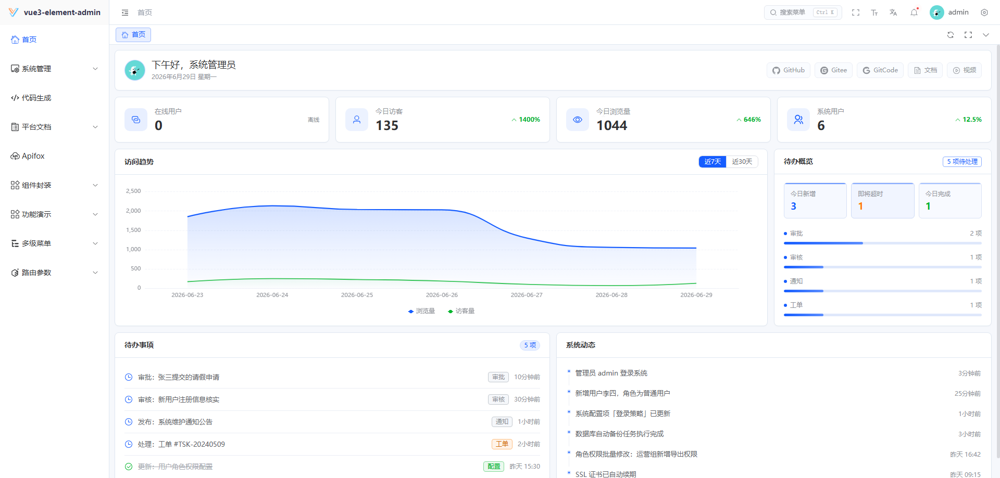

<div align="center">

#  youlai-boot-tenant

**Spring Boot 4 多租户企业级权限管理系统后端**

[](https://spring.io/projects/spring-boot)
[](https://openjdk.org/)
[](#)
[](LICENSE)
[](https://gitee.com/youlaiorg/youlai-boot-tenant/stargazers)
<a href="https://atomgit.com/youlai/youlai-boot"></a>

</div>


<div align="center">

[](https://vue.youlai.tech)
[](https://app.youlai.tech)
[](https://www.youlai.tech/docs/server/spring-boot/)
[](./README.en.md)

</div>

## 项目简介

**youlai-boot-tenant** 是 [youlai-boot](https://gitee.com/youlaiorg/youlai-boot) 的多租户版本，基于 Spring Boot，采用 MyBatis-Plus 单库多租户方案，通过租户 ID 实现数据隔离，专为 SaaS 应用提供后端支持。配套前端 [vue3-element-admin](https://gitee.com/youlaiorg/vue3-element-admin)，共享同一套 API 规范。

## 核心特性

- 🏢 **多租户架构** — 基于 MyBatis-Plus 单库多租户，通过租户 ID 实现数据隔离
- 🔐 **安全体系** — Spring Security + JWT/Redis Token 双会话模式、令牌续期、多端互斥
- 🛡️ **细粒度权限** — RBAC 五级：数据 → 菜单 → 按钮 → 接口 → 字段
- ⚡ **代码生成器** — 一键生成前后端 CRUD 代码
- 📦 **模块齐全** — 用户、角色、菜单、部门、字典、文件、定时任务、消息中心、操作日志
- 🔌 **实时通信** — SSE 推送：在线用户数、字典同步、通知广播

## 系统预览

**PC 端**

<table align="center">
  <tr>
    <td></td>
    <td></td>
  </tr>
  <tr>
    <td></td>
    <td></td>
  </tr>
  <tr>
    <td></td>
    <td></td>
  </tr>
</table>

**移动端**

<table align="center">
  <tr>
    <td></td>
    <td></td>
    <td></td>
    <td></td>
  </tr>
</table>

## 快速开始

**环境要求**：JDK 17+ · MySQL 8.0+ · Redis 6.0+

1. 克隆项目：
   ```bash
   git clone https://gitee.com/youlaiorg/youlai-boot-tenant.git
   ```

2. 导入数据库：
   ```bash
   sql/youlai_admin_tenant.sql
   ```

3. 修改配置（可选，默认已配置线上只读数据源）：
   ```bash
   src/main/resources/application-dev.yml
   ```

4. 启动服务：
   ```bash
   mvn spring-boot:run
   ```
   启动后访问 [http://localhost:8000/doc.html](http://localhost:8000/doc.html)，能打开接口文档即说明后端已正常运行。

详细指南：[部署文档](https://www.youlai.tech/docs/server/spring-boot/deploy) · [开发规范](https://www.youlai.tech/docs/server/spring-boot/dev-standards)

## 前端对接与多租户测试

启动配套前端 [vue3-element-admin](https://gitee.com/youlaiorg/vue3-element-admin)，访问 http://localhost:3000 即可登录：

- 账号：`admin`
- 密码：`123456`

**多租户测试**

- **预置租户**: 平台默认租户 (`tenant_id=0`) 和演示租户 (`tenant_id=1`)。
- **预置账号**: 平台租户 (`root`/`admin`) 和演示租户 (`admin`)，默认密码 `123456`。
- **本地测试**: 修改本地 `hosts` 文件，添加 `127.0.0.1 vue.youlai.tech` 和 `127.0.0.1 demo.youlai.tech，通过不同域名访问即可自动切换租户。

## 目录结构

```
youlai-boot-tenant/
├── docker/                          # Docker 部署编排
├── sql/                             # 数据库初始化脚本
├── src/main/java/com/youlai/boot/
│   ├── YouLaiBootApplication.java   # 启动类
│   ├── auth/                        # 认证授权（登录/登出/令牌）
│   ├── codegen/                     # 代码生成器
│   ├── common/                      # 公共模块（常量/枚举/统一响应）
│   ├── file/                        # 文件服务（MinIO/本地/OSS）
│   ├── framework/                   # 技术框架层
│   │   ├── apidoc/                  # OpenAPI / Knife4j
│   │   ├── cache/                   # Redis / Caffeine 缓存
│   │   ├── captcha/                 # 图形验证码
│   │   ├── integration/             # 短信 / 邮件 / 微信
│   │   ├── job/                     # XXL-Job 定时任务
│   │   ├── mybatis/                 # MyBatis-Plus 配置
│   │   ├── security/                # Security / JWT / Token
│   │   └── web/                     # 全局异常 / 跨域 / 限流
│   ├── message/                     # SSE 消息推送
│   └── system/                      # 系统业务（用户/角色/菜单/部门）
└── pom.xml                          # Maven 依赖管理
```

## 生态矩阵

**前端**

| 项目 | 技术栈 | 说明 | 更新状态 |
|:-----|:-------|:-----|:---------|
| [vue3-element-admin](https://gitee.com/youlaiorg/vue3-element-admin) | Vue 3 + Element Plus | PC 管理前端（主推） | ✅️ |
| [youlai-app](https://gitee.com/youlaiorg/youlai-app) | Vue 3 + UniApp | 移动端 App | ✅️ |

**后端**

| 项目 | 技术栈 | 说明 | 更新状态 |
|:-----|:-------|:-----|:---------|
| [youlai-boot](https://gitee.com/youlaiorg/youlai-boot) | Spring Boot + MyBatis-Plus | Java（主推） | ✅️ |
| [youlai-nest](https://gitee.com/youlaiorg/youlai-nest) | NestJS + TypeORM | Node.js | ✅️ |
| [youlai-gin](https://gitee.com/youlaiorg/youlai-gin) | Go + Gorm | Go | ✅️ |
| [youlai-django](https://gitee.com/youlaiorg/youlai-django) | Django + DRF | Python | ✅️ |
| [youlai-fastapi](https://gitee.com/youlaiorg/youlai-fastapi) | FastAPI + SQLAlchemy | Python | ✅️ |
| [youlai-laravel](https://gitee.com/youlaiorg/youlai-laravel) | Laravel + Eloquent | PHP | ✅️ |
| [youlai-think](https://gitee.com/youlaiorg/youlai-think) | ThinkPHP + ThinkORM | PHP | ✅️ |
| [youlai-aspnet](https://gitee.com/youlaiorg/youlai-aspnet) | ASP.NET Core + EF Core | C# | ✅️ |
| [youlai-axum](https://gitee.com/youlaiorg/youlai-axum) | Axum + SeaORM | Rust | ✅️ |

> 九种后端共享同一套 **RESTful API 规范** 和 **数据库结构**，前端可无缝切换。

**变种与衍生版本**

| 项目 | 基础 | 说明 | 更新状态 |
|:-----|:-----|:-----|:---------|
| [youlai-boot-tenant](https://gitee.com/youlaiorg/youlai-boot-tenant) | youlai-boot | 多租户 SaaS，租户隔离与租户配置 | ✅️ |
| [youlai-boot-flex](https://gitee.com/youlaiorg/youlai-boot-flex) | youlai-boot | 改用 MyBatis-Flex | ✅️ |
| [youlai-boot (db-pg)](https://gitee.com/youlaiorg/youlai-boot/tree/db-pg) | youlai-boot | PostgreSQL 数据库分支 | ✅️ |
| [youlai-boot (multi-module)](https://gitee.com/youlaiorg/youlai-boot/tree/multi-module) | youlai-boot | 多模块工程拆分 | ✅️ |
| [youlai-boot (spring-boot-3)](https://gitee.com/youlaiorg/youlai-boot/tree/spring-boot-3) | youlai-boot | Spring Boot 3 兼容分支 | ✅️ |
| [youlai-nest (multi-tenant)](https://gitee.com/youlaiorg/youlai-nest/tree/multi-tenant) | youlai-nest | 多租户 SaaS，租户隔离与租户配置 | ✅️ |

## 技术合作

本项目采用 [Apache License 2.0](LICENSE) 开源，可免费商用。欢迎在 [Issue](https://gitee.com/youlaiorg/youlai-boot-tenant/issues) 提交问题或反馈，也欢迎提交 [Pull Request](https://gitee.com/youlaiorg/youlai-boot-tenant/pulls) 共建。

如需技术支持、商务合作、二次开发、项目定制或私有化部署，可联系作者微信（见下方二维码）。

<table align="center">
  <tr>
    <td align="center">
      <br>
      <sub>公众号「有来技术」</sub>
    </td>
    <td>&nbsp;&nbsp;&nbsp;&nbsp;</td>
    <td align="center">
      <br>
      <sub>小程序「有来技术」</sub>
    </td>
    <td>&nbsp;&nbsp;&nbsp;&nbsp;</td>
    <td align="center">
      <br>
      <sub>添加作者微信</sub>
    </td>
  </tr>
</table>

<p align="center"><em>技术交流 · 问题反馈 · 商务合作</em></p>
